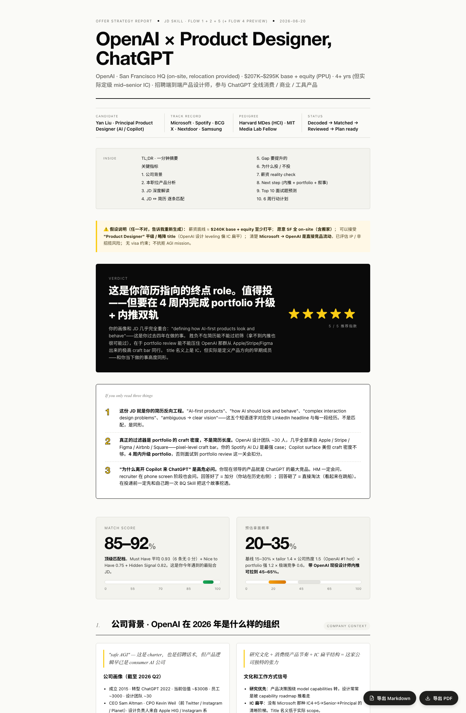

# Job Description Skill

> 🌐 **English** · [中文](./README.zh.md)
>
> 📦 Also available in the **[offer-toolkit-skill](https://github.com/yanliudesign/offer-toolkit-skill)** bundle — one-stop Career Copilot pack (JD · Resume · BQ).

> **JD Decoder & Offer Strategy OS** — translate any Job Description into a complete go/no-go battle map: should you apply, how to apply, how to win. The entry point of the job-hunt chain.

A JD ≠ a recruiting blurb. It's the hiring manager's real expectations, the team's current pain, and the company's culture cues — all wrapped in HR boilerplate. This skill peels that wrapper back off.

---

## How it works — just 3 steps

Invoke the skill with anything like "help me with this job" / "走一下这个 JD" and you go through exactly:

1. **Paste the JD** — link or full text.
2. **Give it your resume** — three options:
   - 🅰️ Upload / paste your full resume (recommended)
   - 🅱️ Paste your full LinkedIn
   - 🅲️ No resume yet → short self-introduction. Results will be flagged as "unverified against a real resume" and you'll be nudged toward **[Resume Skill](https://github.com/yanliudesign/resume-builder-skill)** to build one.
3. **HTML report auto-opens** — a single-file Offer Strategy Report is generated to `~/Desktop/Claude skills/offer-strategy-<slug>.html` and pops open in your browser. Inside: TL;DR verdict, two gauges, the 10 sections below, and in-page Export PDF / Export Markdown buttons.

That's the whole thing. No multi-step wizard, no separate "flow 1" / "flow 2" outputs to wade through — the 5 internal flows (Decode / Match / Tailor / Predict / Should I Apply) all run silently and assemble into the same HTML report.

If you explicitly want only one flow ("only decode this" / "just match score") the skill skips the report and gives you the raw output for that one flow.

---

## 📊 Offer Strategy Report · the 10-section framework

Every wizard run ends with a single-file HTML report at `~/Desktop/Claude skills/offer-strategy-<slug>.html`. The report is **the differentiator** — it's what other JD tools don't give you. Fixed 10-section spine, plus a TL;DR preamble and a key-metrics gauge block:



*Hero of an actual run — verdict + assumptions + TL;DR + two gauges, plus the in-page Export PDF / Export Markdown buttons in the bottom right.*

| # | Section | What it answers |
|---|---------|-----------------|
| — | **TL;DR · one-minute verdict** | Should I apply? ⭐ 1–5. |
| — | **Key metrics** | Match Score gauge + Interview Probability gauge. |
| **1** | **Company background** | Who runs this place, what are the cultural signals, what shipped in the last 12–24 months. |
| **2** | **Product analysis for this role** | What product / surface this role owns + the 4 core design challenges + the *real* scope behind the JD. |
| **3** | **JD deep decode** | Why this JD reads the way it does (Flow 1 essence + Hidden Signal dictionary hits). |
| **4** | **JD ↔ resume line-by-line match** | Must Have cards + full Match Matrix (3 columns: JD ask / resume evidence / score+gap) + Nice + 10-dim Hidden Signal radar. |
| **5** | **Gap — what to upgrade** | 2–4 gap cards with severity (high/middle) + 4-week mitigation. |
| **6** | **Why apply / why not** | 3 reasons each side. Every "why not" comes with an HM probe response. |
| **7** | **Salary reality check** | JD band + market data + negotiation talking points. |
| **8** | **Next step** | Career arc fit + referral playbook (who, DM template) + portfolio audit (4-week action list). |
| **9** | **Top 10 interview questions** | Flow 4 preview. Full Top 20 + behavior stories → hand off to BQ Skill. |
| **10** | **6-week action plan** | Week-by-week to-dos: before applying / after applying / before interview. |

The report supports **Export to PDF** (CJK-safe Noto font embedding) and **Export to Markdown** (single-file MD download). Spec: [`frameworks/offer-strategy-report.md`](frameworks/offer-strategy-report.md) · skeleton: [`examples/offer-strategy-template.html`](examples/offer-strategy-template.html).

---

## Three Ironclad Rules

1. **Decode before you act** — Flow 1 is mandatory before jumping to Flow 2/3. Matching against the wrong target = the match is wrong.
2. **No fabrication** — Never invent experience / skills / numbers the candidate didn't claim. If real evidence is missing, mark it ❌.
3. **One flow at a time** — No mixing. If Flow 1 left ambiguity, clarify before moving on.

---

## File Structure

```
job-description-skill/
├── SKILL.md                      # Entry · routing · three rules
├── prompts/                      # Execution prompts for each flow
│   ├── jd-decoder.md
│   ├── match-score.md
│   ├── resume-tailor.md
│   ├── interview-predictor.md
│   └── should-i-apply.md
├── frameworks/                   # Reusable frameworks / rubrics
│   ├── decode-patterns.md        # JD keyword → real intent dictionary
│   ├── match-rubric.md           # Scoring rubric (Must / Nice / Hidden)
│   ├── resume-tailoring.md       # Three-version resume strategy
│   ├── go-no-go.md               # ⭐ rating + interview probability formula
│   └── offer-strategy-report.md  # Final HTML report — sections, visual system, content rules
├── examples/                     # Reference skeletons (no personal data)
│   └── offer-strategy-template.html
└── jd-bank/                      # Local cache of analyzed JDs (gitignored)
    ├── _index.md                 # Index
    └── _jd-template.md           # Starter template for new JDs
```

---

## Design Principles

- **A JD is a mirror, not a quiz** — It reflects three layers: company, hiring manager, product. Our job is to see through the packaging.
- **Decision before optimization** — Most candidates keep polishing resumes for the wrong roles. This skill decides first whether to apply at all.
- **Reproducible logic, not magic** — Every score and probability comes from an explicit formula. Disagree with the premise? You can argue back.
- **Pairs with [BQ Skill](https://github.com/yanliudesign/Behavior-question-skill) (story mining) + [Resume Skill](https://github.com/yanliudesign/resume-builder-skill) (resume polish) to form the full job-hunt chain.**

---

## Related skills

Part of a three-skill **Career Copilot** chain — decode the JD here, then hand off:

- [resume-builder-skill](https://github.com/yanliudesign/resume-builder-skill) — Resume Builder & Beautifier (11 print-ready templates)
- [Behavior-question-skill](https://github.com/yanliudesign/Behavior-question-skill) — Behavioral interview / Career Story OS

```
See a dream job → JD Skill (decode · match · should-I-apply)
                     ↓ decide to apply
                  Resume Skill (tailor + polish)
                     ↓ get the interview
                  BQ Skill (mine stories · mock interview)
```

---

## License

MIT — fork it, remix it, ship your own version.

Created by [Dreameryanyan](https://www.linkedin.com/in/yanliudesign/) ·
[LinkedIn](https://www.linkedin.com/in/yanliudesign/) ·
[X](https://x.com/yanliudreamer) ·
[Xiaohongshu](https://www.xiaohongshu.com/user/profile/5b2afdf311be104ac3c22931)
